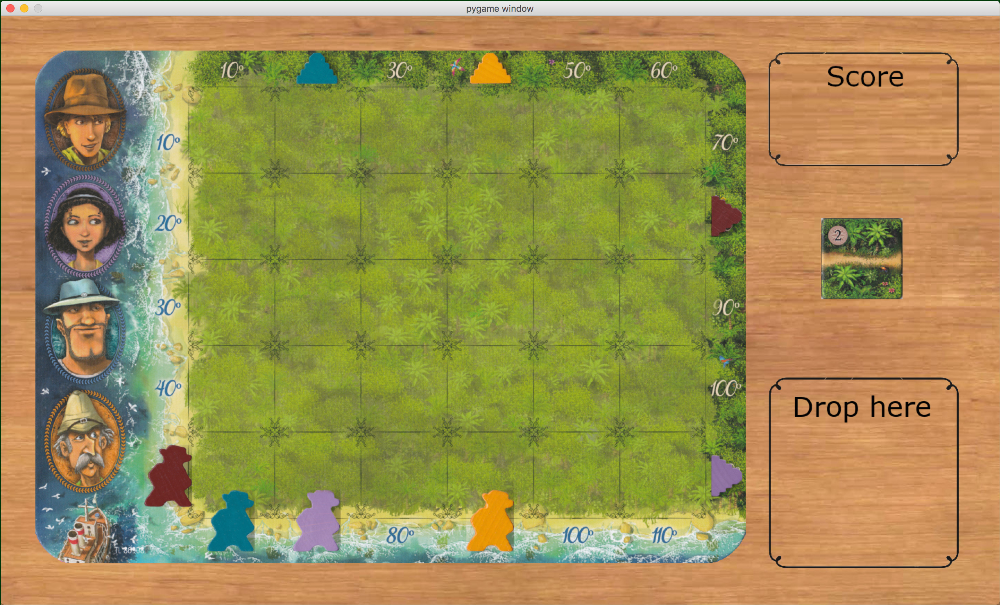

KARUBA
******

This is a simple implementation of the board game `Karuba <https://www.trictrac.net/jeu-de-societe/karuba>`_.

It relies on `pygame <https://www.pygame.org>`_.

How to play?
============

You just need to clone, install a Python environment with required dependencies and run.

.. code:: bash

    conda create -n karuba python=3.6
    source activate karuba
    git clone https://github.com/LowikC/karuba.git
    cd karuba
    pip install .
    python main.py

Here is a screenshot of the game:

